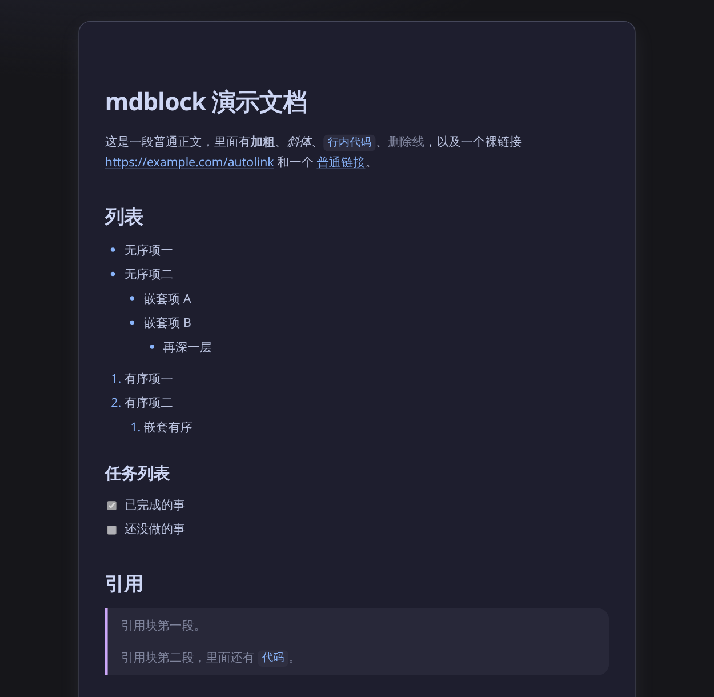

# mdblock

把 Markdown 文件构建成一个**可以嵌进任意网页的文章块**：一段自包含的 HTML 片段加一份样式表。
配色由主题配置文件驱动，内置 10 个常见开源主题；外框、尺寸、字号等都可配置。

- **零运行时 JS** —— 产物里只有 `<div class="mdblock">` 和 `<style>`，没有 `<script>`，
  没有 Web Component，没有 iframe。无 JS 环境照样显示。
- **样式不泄漏** —— 所有规则挂在 `.mdblock` 前缀下，主题变量定义在
  `.mdblock[data-theme="<id>"]` 上，所以**同一页可以贴多篇不同主题的文章块**。
- **高亮与主题解耦** —— 代码高亮只产出 `var(--shiki-*)` 引用，不写死任何色值。
  **换主题不需要重新高亮**，一份 HTML 可以配任意主题的样式表。



## 快速开始

```bash
bun install
bun src/cli.ts examples/post.md -o post.html          # 自包含片段，直接粘进页面
bun src/cli.ts examples/post.md                       # 不传 -o 就写到 stdout
```

## CLI

```
mdblock <input.md> [options]
mdblock <input.md>... -d <outdir> [options]
```

| 选项 | 说明 | 默认 |
|---|---|---|
| `-o, --out <file>` | 单文件输出路径 | stdout |
| `-d, --outdir <dir>` | 批量输出目录，每个输入产一个同名 `.html` | — |
| `-c, --config <file>` | JSON 配置文件，键名同长选项（camelCase 或 kebab-case） | — |
| `--theme <ref>` | 内置主题 id，或主题文件路径 | `catppuccin-latte` |
| `--width` | 根元素 `max-width` | `720px` |
| `--font-size` | 正文字号 | `17px` |
| `--line-height` | 行高（数字） | `1.7` |
| `--font-family` | 字体栈 | 系统栈 |
| `--padding` | 内边距 | `32px` |
| `--radius` | 圆角 | `12px` |
| `--border` | 边框的完整 CSS 值；空串＝无边框 | `""` |
| `--shadow` | `none` / `soft` / `hard` / `ring`，或原始 `box-shadow` | `soft` |
| `--bg` | 背景色 | 主题的 `colors.bg` |
| `--tag` | 根元素标签 `div` / `article` / `section` | `div` |
| `--hard-isolation` | 根元素追加 `all: revert`，丢掉宿主打在根元素上的作者级声明 | off |
| `--css` | `inline`（自包含）/ `file`（产出 `mdblock.css` + `<link>`）/ `none` | `inline` |

优先级：内置默认 → `--config` 文件 → CLI flag（后者覆盖前者）。

退出码：`0` 成功，`2` 用法错误（未知选项、文件不存在、批量同名冲突……），`1` 运行期错误
（主题没找到、JSON 非法……）。错误信息一律写 stderr。

### 配置文件

```json
{
  "theme": "catppuccin-mocha",
  "width": "760px",
  "fontSize": "17px",
  "radius": "14px",
  "shadow": "soft",
  "hardIsolation": false
}
```

未知键与类型不符都会被拒绝（退出码 2），不会静默忽略。

## 内置主题

`catppuccin-latte`（默认）· `catppuccin-frappe` · `catppuccin-macchiato` · `catppuccin-mocha`
· `nord` · `gruvbox-dark` · `tokyo-night` · `rose-pine-dawn` · `solarized-dark` · `dracula`

所有色值都取自各主题的官方调色板，来源 URL 记在 `themes/_sources.json`。内置主题按
**包内目录**解析，所以在任何 cwd 下都能用。

### 自定义主题

主题就是一个 JSON 文件，结构与 `themes/_schema.json` 一致：

```json
{
  "name": "My Theme",
  "extends": "nord",
  "colors": {
    "accent": "#ff7a45",
    "syntax": { "keyword": "#ff9e64" }
  }
}
```

- `extends` 可以指向内置 id 或另一个主题文件；**按键覆盖**，不是整体替换；循环引用会报错。
- 没有 `extends` 时必须给出全部颜色 token：10 个 UI token（`bg` `surface` `text` `heading`
  `muted` `border` `accent` `accentAlt` `codeBg` `codeText`）+ `syntax` 的 12 个键。
- 用 `--theme ./my-theme.json` 加载。可以直接照抄 `examples/theme-example.json` 的形状。

## 样式 API

想微调外观时，覆盖 CSS 变量即可 —— 它们是稳定接口，不用改 mdblock 的代码。
注意变量定义在 `.mdblock[data-theme="<id>"]` 上，所以**覆盖时要用同选择器或更高特异性**：

```css
.mdblock[data-theme="nord"] {
  --mdblock-accent: #ff7a45;   /* 链接与强调色 */
  --mdblock-radius: 6px;
}
```

可用的变量：

| 组 | 变量 |
|---|---|
| 面 | `--mdblock-bg` `--mdblock-surface` `--mdblock-text` `--mdblock-heading` `--mdblock-muted` |
| 线与强调 | `--mdblock-border-color` `--mdblock-accent` `--mdblock-accent-alt` |
| 代码 | `--mdblock-code-bg` `--mdblock-code-text` |
| 布局 | `--mdblock-width` `--mdblock-padding` `--mdblock-radius` `--mdblock-font-size` `--mdblock-line-height` `--mdblock-font-family` |
| 外框 | `--mdblock-border` `--mdblock-shadow` |
| 高亮 | `--shiki-foreground` `--shiki-background` `--shiki-token-*`（`string` `comment` `constant` `keyword` `parameter` `function` `string-expression` `punctuation` `link` `inserted` `deleted` `changed`） |

## 嵌进页面

```html
<link rel="stylesheet" href="mdblock.css">   <!-- --css file 模式下 -->
<!-- 把 -o 产出的片段（或 dist/*.html 的内容）粘在这里 -->
```

三种模式的取舍：

- `--css inline`（默认）：产物自包含，一段 HTML 贴进去就完事。**同页多主题**用这个
  （每个块带自己的 `<style>`）。
- `--css file`：样式表只产一份、多篇文章共用，改配色只换一个文件。适合博客全站。
- `--css none`：只出标记，样式完全由你自己写。

产物里**没有任何字面色值**（只有 `var(--shiki-*)` 引用），可以直接用 grep 之类验证。

## 已知限制

- **宿主带 `!important`，或特异性高于 `.mdblock X` 的 descendant 规则会穿透**，
  例如宿主页写了 `.prose p { color: gray }`（两个类 + 一个元素，压过我们的 `.mdblock p`）。
  这是命名空间 CSS 的固有边界，不是 bug。可用的缓解手段：把文章块放在宿主这类
  prose 容器**之外**；或用 `--hard-isolation`（它会丢掉宿主打在**根元素**上的作者级声明，
  但挡不住宿主对后代元素的规则）。
- 批量模式下**同名 basename 会报用法错误**而不是互相覆盖 —— 需要改名或拆成两次调用。
- 一个页面里同一主题只能有一份变量定义（同一 `data-theme` 的两个块必然共用一套变量）。
  要更细的粒度就自己覆盖变量。

## 开发

```bash
bun run test        # 164 个单元测试
bun run typecheck   # tsc --noEmit
bun run accept      # 端到端验收：真实 CLI 产出 + 契约不变量 + 组装敌意宿主页
```

`bun run accept` 会生成 `dist/hostile.html` —— 一个故意写得很丑的宿主页面
（全局 reset、body 上的大字距与全大写、加料的表格/代码/引用样式），
里面并排放着三个不同主题的文章块，并在页面上自报 18 条 computed-style 判据。
直接用浏览器打开它就能肉眼确认隔离效果。

架构与设计决策见 `docs/design/`；模块接口契约见 `docs/orch/CONTRACT.md`；
文档导航见 `docs/README.md`。

## 许可

[MIT](LICENSE)
